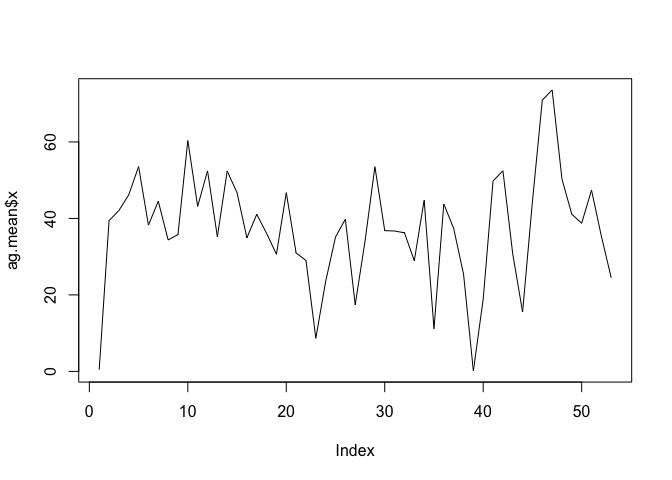
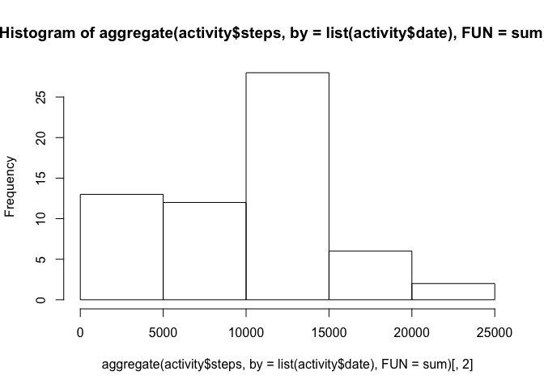
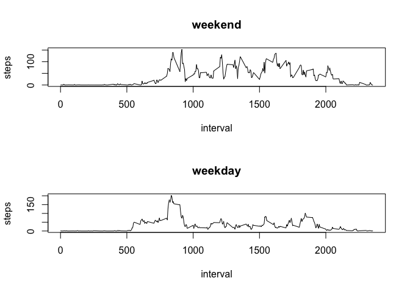

RepData\_PeerAssessment1
================
Cyrus Safaie
August 7, 2016

1.  Code for reading in the dataset and/or processing the data

``` r
library(knitr)
library(rmarkdown)
```

``` r
activity=read.csv("activity.csv")
activity2=subset(activity,activity$steps!="NA")
head(activity)
```

    ##   steps       date interval
    ## 1    NA 2012-10-01        0
    ## 2    NA 2012-10-01        5
    ## 3    NA 2012-10-01       10
    ## 4    NA 2012-10-01       15
    ## 5    NA 2012-10-01       20
    ## 6    NA 2012-10-01       25

1.  Histogram of the total number of steps taken each day

``` r
ag.data=aggregate(activity2$steps, by=list(activity2$date), FUN=sum)
dev.off()
```

    ## null device 
    ##           1

``` r
hist(ag.data$x)
library(ggplot2)
#qplot(ag.data$x)+stat_bin(bins=5)
```

1.  Mean and median number of steps taken each day

``` r
c(mean(ag.data$x),median(ag.data$x))
```

    ## [1] 10766.19 10765.00

``` r
ag.mean=aggregate(activity2$steps, by=list(activity2$date), FUN=mean)
ag.median=aggregate(activity2$steps, by=list(activity2$date), FUN=median)
```

1.  Time series plot of the average number of steps takent

``` r
plot(ag.mean$x,type = "l")
```



1.  The 5-minute interval that, on average, contains the maximum number of steps

``` r
interval.mean=aggregate(activity2$steps, by=list(activity2$interval), FUN=mean)
which.max(interval.mean$x)
```

    ## [1] 104

``` r
max(interval.mean$x)
```

    ## [1] 206.1698

1.  Code to describe and show a strategy for imputing missing data

``` r
# replacing na with 0
activity[is.na(activity)]=0
```

1.  Histogram of the total number of steps taken each day after missing values are imputed

``` r
hist(aggregate(activity$steps, by=list(activity$date), FUN=sum)[,2])
```



1.  Panel plot comparing the average number of steps taken per 5-minute interval across weekdays and weekends

``` r
activity$wkDY=rep("weekday",length(activity$date))

activity$wkDY[(weekdays(as.Date(activity$date))=="Sunday") | (weekdays(as.Date(activity$date))=="Saturday")]="weekend"


par(mfrow = c(2, 1))
for (type in c("weekend", "weekday")) {
        steps.type <- aggregate(steps ~ interval, data = activity, subset = activity$wkDY == 
                                        type, FUN = mean)
        plot(steps.type, type = "l", main = type)
}
```


